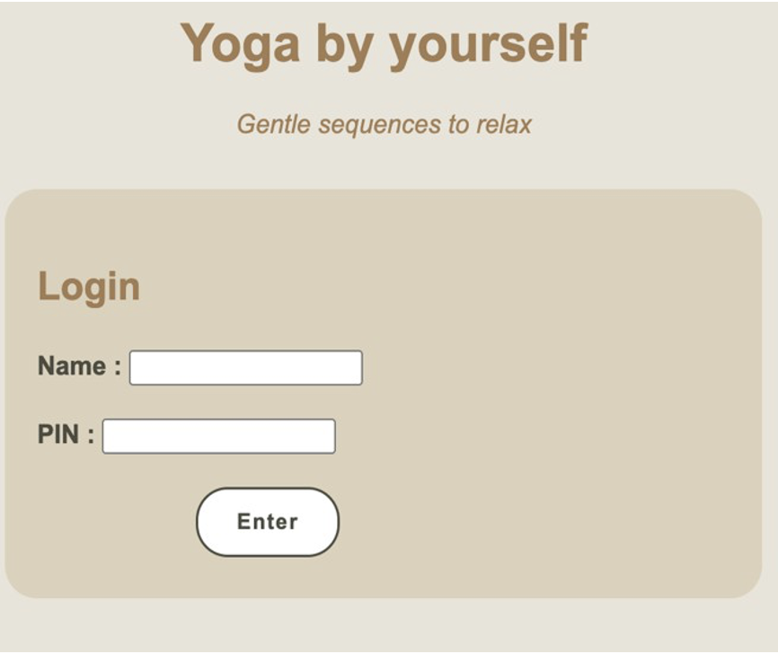
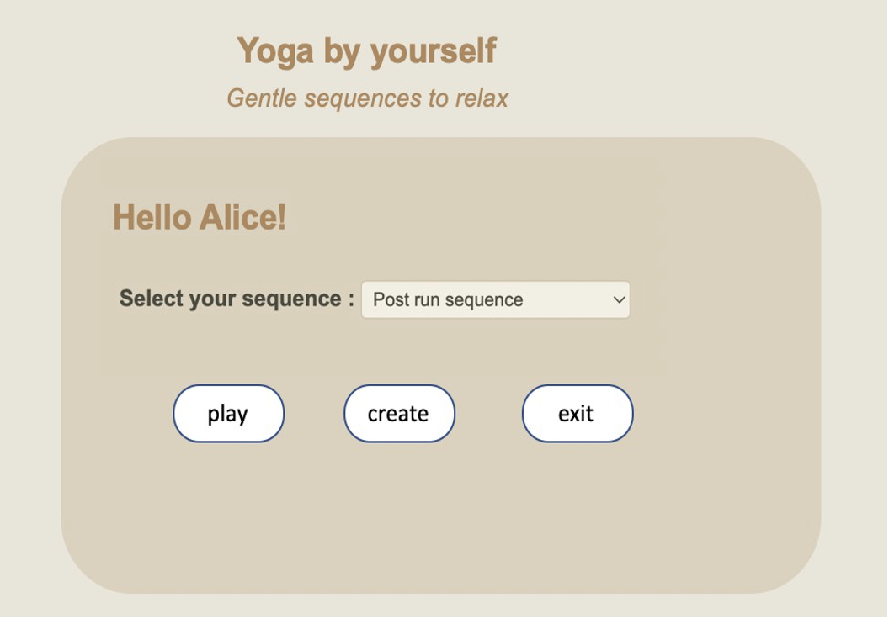
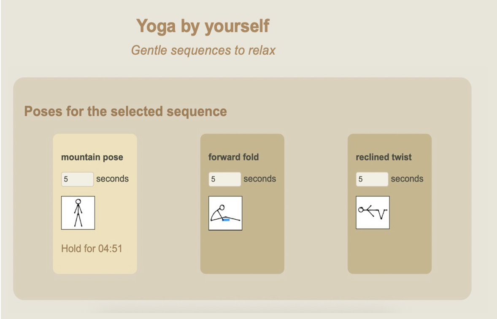
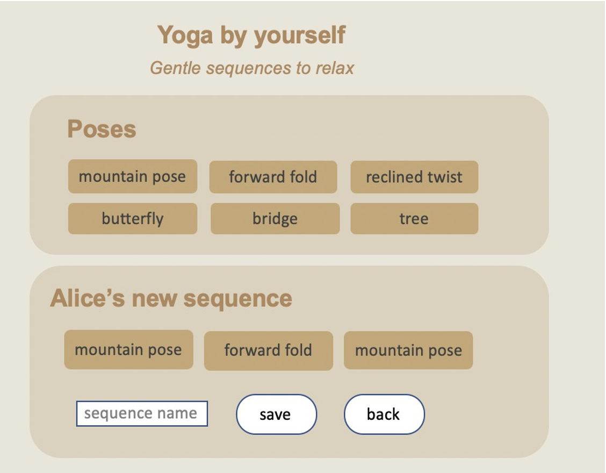

## Assessment Brief - Web-Based Information Systems Development (SPR)

### 1.	The task
#### 1.1.	What do I need to do?

This assessment includes three tasks:
* Task 1 (landing page and login)
* Task 2 (load sequences from DB and display)
* Task 3 (building and storing new sequences)
* Task 4 (APIs discussion)

Two important constraints:
(1)	You must use Dragon as MySQL server for your DB and set it up appropriately so that we can run your project. We need to be able to run your project by simply copying the content of your submission in the public_html folder on Raptor.

(2)	In all three tasks, you must only use HTML, CSS, JavaScript, PHP, MySQL primitives demonstrated in the lectures. The use of external libraries, frameworks, externally loaded fonts, or pre-existing style sheets is not permitted.

While professional environments may permit the use of higher-level tools, developers are routinely required to operate within fixed constraints, such as mandated technologies, legacy systems, security policies, or performance requirements. This assessment therefore evaluates your ability to reason about solutions using a limited set of foundational primitives, which require an understanding of the underlying principles, and to work effectively within such constraints, rather than assembling disparate code snippets and components.

##### Task 1: structure & presentation [10 marks]
* Create a page index.html with some external styling, a heading, and a form for inputting a ID (text), a preferred name (text), and a password (text).
* Give a default value to all the input fields (to help markers!) and make sure that all fields are filled before submitting the form. Submission should execute a file main.php that you need to create.
* File main.php should check that the ID and password exist in the database. If so, do nothing for now, if not, redirect to index.html.
* See below a snapshot of how a (minimal) version may look like.

 

##### Task 2: select, visualize, and play a sequence [35 marks]
* In this task you need to extend main.php from Task 1. This script should generate a page with the same style and heading than index.html.
* The page must welcome the user by writing “Hello xxx!” where xxx is the preferred name specified by the user in the form in index.html.
* The script must load (from the database) about all the sequence names created by the current user and list them in a select field. We have provided you with a file yogaDB.txt (on Moodle) to help you set up and populate the database.
* After the table, you need to add two buttons:
  * “select” : triggers a script yogalanding.php;
  * “create” : loads a new page create.php;
  * “exit” : redirect to index.php and closes the session;
* See below a snapshot of how a (minimal) version may look like.

 

 
* Pressing “play” should trigger the execution of play.php that displays the sequence and plays it. You have already done this in Assessment 1. It should look like the following:

 

* After playing the sequence you should redirect to main.php.

##### Task 3: create a sequence [40 marks]
If the user presses “create” in the page generated by main.php a new script create.php should be executed. In this task you will write the create.php script.
* Create two section in your page: one for the poses and one for the sequence you as shown below:

 

* Load all the pose names from the database and display them in the poses section.
* When the user clicks a pose, add it to the sequence section, maintaining the selection order of the user.
* Allow the user to enter a name for the sequence and, if they press the button “save”, insert the sequence into the database. Make sure you have all the necessary data for that (use superglobals if needed).
* Make sure you add some validation here.
* After saving the pose, or in response to the user pressing back, redirect to main.php.

##### Task 4: reason and reflect [15 marks]
Your application currently stores poses in a local database and uses them when users build sequences. In real systems, reference data like this is often reused from external providers rather than manually curated. Your customer asks you to use a publicly accessible web service (https://github.com/alexcumplido/yoga-api) that exposes a catalogue of yoga poses (names, descriptions, etc.).
Your task is to design (not implement) a backend feature that can populate and maintain your local pose database using this service. You do not have to write code. You need to explain in words:
1.	Which technologies you would use (e.g., languages, principles seen in lectures) and their relevance here.
2.	How you would integrate the external pose data format with your database format. Comment on whether a complete, fully automated mapping is possible, and identify any limitations.
3.	Briefly discuss how you would go about implementing this, e.g., which files in your solution to Task 3 you would add or modify to accommodate a feature that stores store the data (including how you would handle updates over time).
In your answer, explicitly justify your design choices by referring to the web service concepts and principles discussed in the module (e.g., service orientation, statelessness, web protocols, distributed systems concerns, representation formats such as XML/JSON, transformation/adapters, reuse, scalability). A good answer should be well reasoned, written in your own words, and approximately three paragraphs long.

#### 1.2.	Use of Generative AI?
This assessment is built to make you use AI and LLMs more effectively and efficiently. You can use any LLM of your choice to complete all the required tasks. This assessment will also test your prompting skills.

#### 1.3.	What will I submit? Are there any special formatting or referencing styles expected?
Submit your solution on Moodle as one single ZIP file xxx.zip where xxx is your student login id (e.g.,lb514.zip). The zip file must contain the following:
* task1.zip containing your solution for Task 1,
* task2.zip containing your solution for Task 2, 
* task3.zip containing your solution for Task 3,
* task4.zip containing your solution for Task 4. This can be a text file.

### 2. Marking Criteria- How will my assignment be marked?	

The marking rubric is provided with this brief in Section 1.1.
We are looking for simple clean code that uses basic primitives seen in lectures.

Task 1 [10 marks]
* Correct, valid, well styled page [3]
* Validation [3]
* Correct check with DB and redirection [4]

Task 2 [35 marks]
* Good display of information (name) and style [5]
* Good load of sequences in select from Dragon [10]
* Button play and its handling [8]
* Display of selected sequence (its poses) from Dragon, play, and redirection back [12]

Task 3 [40 marks]
* Creation page has all required elements [5]
* Display poses from database (Dragon) [6]
* Correct display of selected poses in sequence section [11]
* Correct saving completed pose and redirection [8]
* Validation [10]

Task 4 [15 marks]
Each answer should be a concise (e.g., one paragraph) but well thought reflexion in own words:
* technologies involved (e.g., languages, principles seen in lectures) and their relevance here;
* mapping, based on the specific data sets at hand;
* how you would go about implementing this, with justification.
